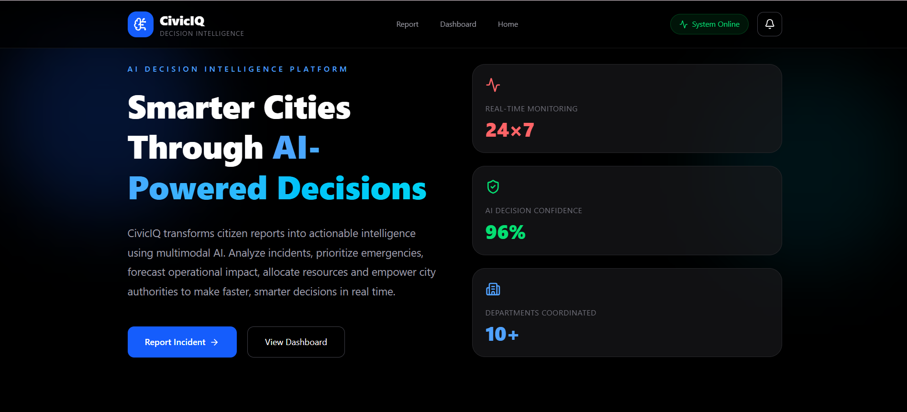
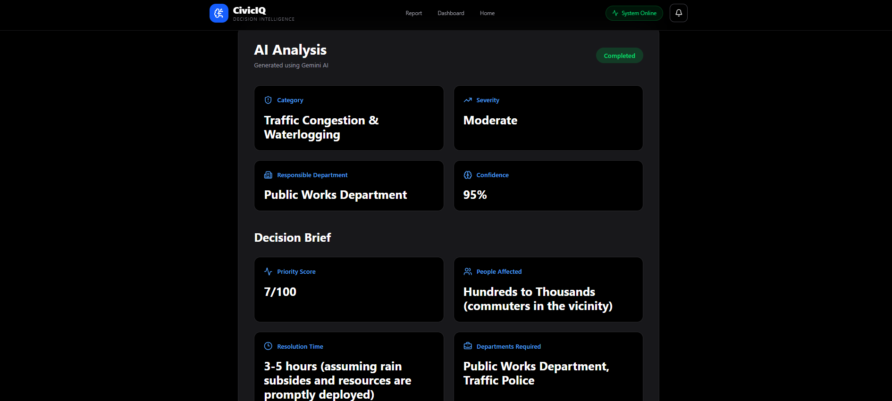
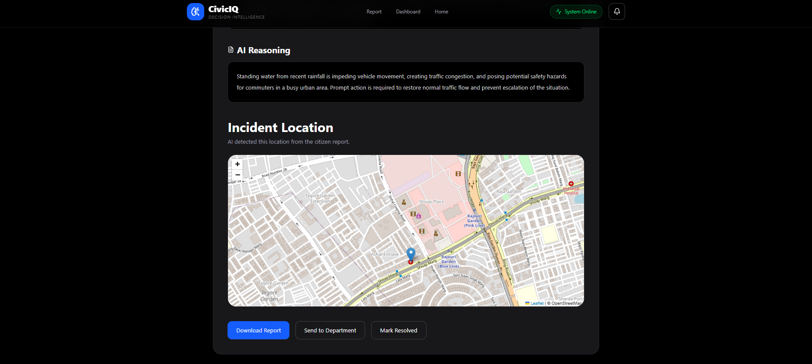
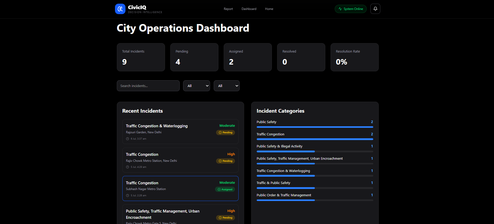

# 🚀 CivicIQ — AI Decision Intelligence Platform

<div align="center">


**AI-powered Decision Intelligence for Smarter Cities**

Turning citizen reports into actionable operational intelligence with multimodal AI, predictive analytics, and intelligent decision support.

[Live Demo](https://civiciq-gamma.vercel.app/) · [Backend API](https://civiciq-f77f.onrender.com/) 
</div>

---

## 📌 Problem Statement

Modern cities receive thousands of citizen complaints every day — traffic, waste management, public safety, illegal activity, infrastructure failures, environmental hazards, and emergencies.

Most civic-tech systems only **collect** these complaints. They don't help authorities **decide**. Officials are still left to manually work out:

- Priority and severity
- The responsible department
- Resource allocation
- Likely future impact
- Operational planning

This slows down response times and drives up operational cost.

## 💡 Our Solution

**CivicIQ** converts raw citizen reports into structured operational intelligence using **Google Gemini**, multimodal analysis, predictive forecasting, and automated department routing.

Instead of reading every report manually, officials instantly get:

- An AI-generated summary
- Severity and priority scoring
- A department recommendation
- Suggested resource allocation
- An operational forecast
- A geographic view of the incident
- City-wide analytics on a live dashboard

---

## ✨ Key Features

### 🤖 AI Incident Analysis
Natural language understanding, multimodal image + text analysis, automatic incident classification, severity prediction, and an AI confidence score with explainable reasoning.

### 🧠 Decision Intelligence
Every incident is scored and enriched with a priority score, estimated people affected, resolution-time prediction, required departments, operational impact analysis, and recommended actions.

### 📈 Predictive Forecasting
AI forecasts 6-hour and 24-hour impact windows, traffic escalation, emergency delays, risk levels, and citizen impact.

### 🚓 Smart Resource Recommendation
Automatically estimates the police officers, traffic marshals, ambulances, tow trucks, and barricades needed, along with an estimated deployment cost.

### 🗺️ Live Incident Mapping
Automatically geocodes each incident and plots it on a map alongside its priority and severity.

### 🏛 Smart Department Routing
Routes incidents to the relevant authority automatically — Traffic Police, Municipal Corporation, Public Works, Health Department, Fire Department, or Disaster Management.

### 📊 City Operations Dashboard
A live view of total incidents, pending and assigned cases, resolution rate, category analytics, department workload and status, plus search, filtering, and incident drill-down.

### 📄 AI-Generated Reports
One-click, downloadable PDF reports containing the AI analysis, operational impact, resource recommendations, forecast, and decision brief.

---

## 🏗️ System Architecture

```
Citizen
  │
  ▼
React Frontend (Vercel)
  │
  ▼
FastAPI Backend (Render)
  │
  ▼
Google Gemini AI
  │
  ▼
Decision Intelligence Engine
  │
  ├──► Firebase Firestore
  ├──► Resource Recommendation
  ├──► Forecast Engine
  └──► Dashboard Analytics
```

---

## 🛠 Tech Stack

| Layer | Technologies |
|---|---|
| **Frontend** | React, TypeScript, Vite, Tailwind CSS, Leaflet Maps, Lucide Icons |
| **Backend** | FastAPI, Python, Uvicorn |
| **AI** | Google Gemini, Prompt Engineering, Multimodal AI, Decision Intelligence |
| **Database** | Firebase Firestore |
| **Deployment** | Vercel (frontend), Render (backend) |

---

## 📂 Project Structure

```
CivicIQ/
├── frontend/
│   └── src/
│       ├── components/
│       ├── pages/
│       ├── services/
│       ├── types/
│       └── assets/
├── backend/
│   ├── main.py
│   ├── requirements.txt
│   └── utils/
└── README.md
```

---

## ⚙️ Getting Started

### Clone the repository

```bash
git clone https://github.com/yourusername/civiciq.git
cd civiciq
```

### Frontend

```bash
cd frontend
npm install
npm run dev
```

### Backend

```bash
cd backend
pip install -r requirements.txt
uvicorn main:app --reload
```

### Environment Variables

**Frontend** — `frontend/.env`

```env
VITE_FIREBASE_API_KEY=
VITE_FIREBASE_AUTH_DOMAIN=
VITE_FIREBASE_PROJECT_ID=
VITE_FIREBASE_STORAGE_BUCKET=
VITE_FIREBASE_MESSAGING_SENDER_ID=
VITE_FIREBASE_APP_ID=
VITE_FIREBASE_MEASUREMENT_ID=
```

**Backend** — `backend/.env`

```env
GEMINI_API_KEY=
```

---

## 📊 Workflow

1. Citizen submits a complaint (text and/or image)
2. Gemini analyzes the content
3. Incident is categorized and severity is calculated
4. Responsible department is identified
5. Resources are recommended
6. A forecast is generated
7. The incident is stored in Firestore
8. The dashboard updates in real time
9. Authorities receive actionable, ranked insights

---

## 🎯 Solution Areas Covered

Urban Mobility · Public Safety · Citizen Engagement · Smart Governance · Disaster Preparedness · Intelligent Public Services · AI Decision Support

## 🧠 Google Technologies Used

Google Gemini · Prompt Engineering · Multimodal AI · Natural Language Understanding

---

## 🔮 Future Scope

- RAG over historical incident data
- Live CCTV and IoT sensor integration
- Citizen mobile app and WhatsApp complaint bot
- AI voice reporting
- Predictive hotspot detection
- Drone-assisted monitoring
- Live emergency routing
- Multi-language support
- Explainable AI dashboard

---

## 📸 Screenshots

### Landing Page



---

### AI Analysis



---

### Incident Map



---

### Dashboard



## 🎥 Demo Video

*(Add YouTube link here)*

---

## 🌐 Live Links

- **Frontend:** [civiciq-gamma.vercel.app](https://civiciq-gamma.vercel.app/)
- **Backend:** [civiciq-f77f.onrender.com](https://civiciq-f77f.onrender.com/)

---

## 👥 Team

**Backstreet Geeks** — Project: **CivicIQ**, AI Decision Intelligence Platform

---

<div align="center">

Built for **Google Cloud x Hackathon** — empowering smarter cities through AI-powered decision intelligence.

</div>
